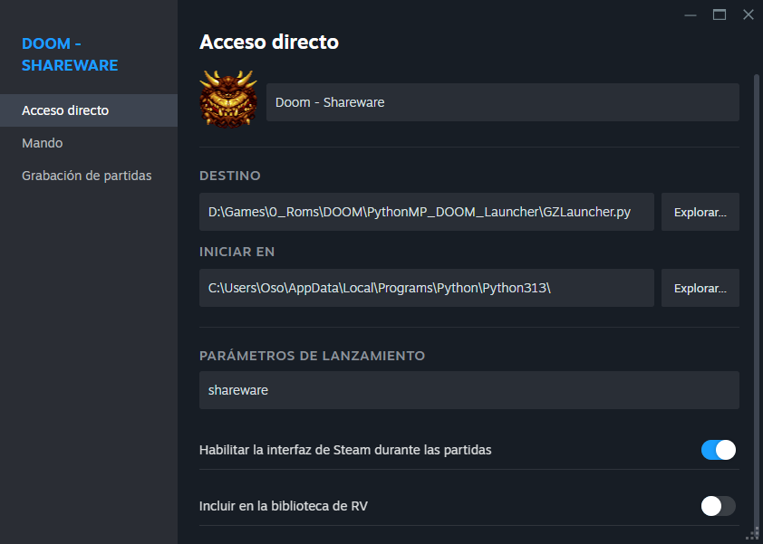

# DoomyLauncher

A basic launcher for GZDoom written in Python.

# How to Use

## Super Basic Usage:

To run the launcher, simply execute the script and pass the name of the preset as an argument:

```
$ GZLauncher.py <preset>
```

> Before using the command properly, you must configure the launcher and define your own presets. Otherwise, only the default shareware preset `shareware.json` will be available.

You can specify the preset either by name alone or including the `.json` extension. In both cases, the script will search for the corresponding preset file in the "presets_local_dir" directory (by default: `presets`):

```
/ (Script directory)
├── GZLauncher.py
├── config.cfg
└── presets (defined by the variable "presets_local_dir")
    ├── template.json
    └── ... (more preset files)
```

Example: If you created a preset named "The ultimate DOOM", the command would be:

```
$ GZLauncher.py "The ultimate DOOM"
```

This will look for and execute the preset file `"The ultimate DOOM.json"` in the script's preset directory.

Example of a preset:

```json
{
    "iwad": "{{iwads}}The Ultimate DOOM/DOOM.WAD",
    "mods": [
        "{{mods}}IDKFA/IDKFA.wad"
    ],
    "config": "{{saves}}global.cfg",
    "saveDir": "{{saves}}doom.id.doom1.ultimate"
}
```

Next, we'll explain how the configuration file works.

---

## The `config.cfg` File

The `config.cfg` file is the main configuration file of the script. Here you define "dynamic variables" for each supported system (Windows, Linux, and macOS), as well as general settings for the launcher.

By default, the dynamic variables represent the main paths to your IWADs, mods, GZDoom config files, and save directories.

Before you can use the script, you must set these variables—most importantly, the location of the GZDoom executable (on Linux, if installed via a package manager, simply using `gzdoom` should work).

Declaring these variables is optional, and you could use absolute paths directly in your presets, but doing so is not recommended if you plan to use the script across multiple systems.

Example of a basic configuration for Windows:

```
[Windows]
# Windows Path Config
iwads=D:\Games\0_Roms\DOOM\iwads
mods=D:\Games\0_Roms\DOOM\mods
config=D:\Games\0_Roms\DOOM\configs
saves=D:\Games\0_Roms\DOOM\saves

gzDoomBin=D:\Games\0_Emulators\GZDoom\gzdoom.exe
```

> WARNING: To avoid file-loading errors, do not wrap variable values in double quotes (`"`).

---

## Presets

Presets are JSON files that define the paths (absolute or relative using dynamic variables) of the files needed to run GZDoom.

Each preset declares:

* The IWAD to use (a standalone game file such as `doom.wad`, `doom2.wad`, `freedoom.wad`, etc.)
* The mods to load (order matters and follows the list order)
* The GZDoom config file
* The directory to store save files (using a dedicated save directory per preset is strongly recommended to avoid mix-ups between vanilla and modded saves)

Example preset for "The Ultimate DOOM" with the "IDKFA" music mod:

```json
{
    "iwad": "{{iwads}}The Ultimate DOOM/DOOM.WAD",
    "mods": [
        "{{mods}}IDKFA/IDKFA.wad"
    ],
    "config": "{{saves}}global.cfg",
    "saveDir": "{{saves}}doom.id.doom1.ultimate"
}
```

To use dynamic variables in presets, simply enclose them in double curly braces (`{{}}`).

In other words, the value `"{{iwads}}The Ultimate DOOM/DOOM.WAD"` will resolve at runtime by replacing `{{iwads}}` with the value defined in `config.cfg` for the current operating system.

This greatly simplifies managing and creating new presets, avoiding the need to hardcode absolute paths.

---

### Dynamic Variables

Dynamic variables are a set of keys used to store the main directory paths (wads, mods, configs, saves), declared in the `config.cfg` file.

There’s one set of dynamic variables for each supported platform (Windows, Linux, macOS):

```
[Windows]
# Windows Path Config
iwads=
mods=
config=
saves=

gzDoomBin=

[Linux]
# Linux Path Config
iwads=
mods=
config=
saves=

gzDoomBin=gzdoom

[Darwin]
# macOS Path Config
iwads=
mods=
config=
saves=

gzDoomBin=
```

This OS-based configuration allows you to run the same script on multiple systems that share the same folder structure.

Example: On my setup, I use an external drive for games (`D:` on Windows, `/mnt/Extern` on Linux). By defining the same logical paths on both systems, I don’t need to worry about changing preset files between them.

---

# Using with Steam

I originally created this script to make it easier to add my WADs to Steam. It’s fully compatible with that setup—just add the script to Steam as a non-Steam game, and set the preset name as the launch argument.


